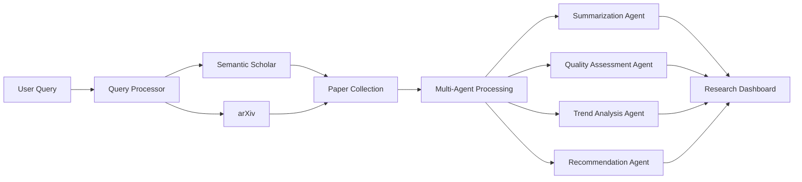
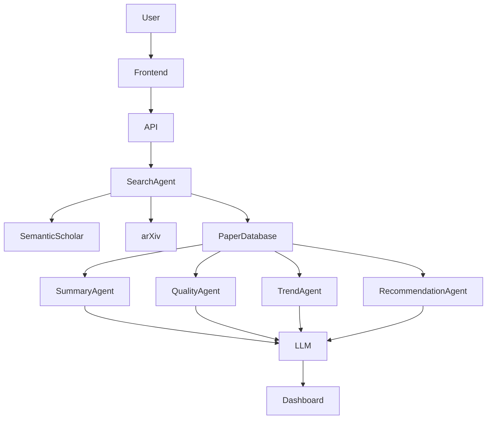

<div align="center">

# NeuroAI
## AI-Powered Multi-Agent Research Assistant

<p align="center">


<br>


</p>

</div>

---

# Overview

NeuroAI is an AI-powered research assistant designed to simplify academic research in Artificial Intelligence and Neuroscience. The platform uses a multi-agent AI architecture to search, analyze, summarize, and evaluate research papers while generating actionable insights and recommendations.

By integrating multiple research databases and large language models, NeuroAI enables researchers, students, and professionals to explore scientific literature more efficiently and make informed research decisions.

---

# Key Features

- Multi-agent AI architecture
- Intelligent research paper discovery
- Semantic search across academic literature
- AI-generated paper summaries
- Research quality assessment
- Citation extraction and recommendations
- Trend analysis across publications
- Research insight generation
- Interactive research dashboard
- Fast and intuitive user interface

---

# System Workflow



---

# Multi-Agent Architecture



---

# Research Processing Pipeline

```text
Research Query

      │

      ▼

Semantic Search

      │

      ▼

Retrieve Research Papers

      │

      ▼

Multi-Agent Processing

──────────────────────────────

Paper Summarization

Quality Assessment

Citation Analysis

Trend Detection

Research Recommendations

──────────────────────────────

      │

      ▼

Structured Research Insights
```

---

# Technology Stack

| Technology | Purpose |
|------------|----------|
| Next.js | Frontend Framework |
| Python | Backend Services |
| Together AI | LLM Integration |
| DeepSeek | AI Reasoning |
| Semantic Scholar API | Research Paper Search |
| arXiv API | Academic Paper Retrieval |
| REST APIs | Data Integration |
| JavaScript | Frontend Logic |

---

# Project Structure

```text
NeuroAI/

├── frontend/
│   ├── pages/
│   ├── components/
│   ├── styles/
│
├── backend/
│   ├── agents/
│   ├── api/
│   ├── services/
│   ├── summarizer.py
│   ├── search.py
│   ├── recommendations.py
│
├── database/
├── utils/
├── public/
├── package.json
└── README.md
```

---

# AI Agents

| Agent | Responsibility |
|--------|----------------|
| Search Agent | Retrieves relevant research papers |
| Summary Agent | Generates concise paper summaries |
| Quality Agent | Evaluates paper credibility and impact |
| Trend Agent | Identifies emerging research trends |
| Recommendation Agent | Suggests related papers and future reading |

---

# Example Workflow

```text
User searches

"Brain-Computer Interfaces"

        │

        ▼

Search Semantic Scholar & arXiv

        │

        ▼

Collect Relevant Papers

        │

        ▼

Multi-Agent Analysis

        │

        ▼

Generate

• Summary

• Research Trends

• Quality Score

• Citation Information

• Related Papers

        │

        ▼

Display Interactive Dashboard
```

---

# Future Improvements

- PDF upload and analysis
- Citation graph visualization
- Personalized research recommendations
- Research collaboration features
- AI-powered literature review generation
- Knowledge graph visualization
- Local LLM support
- Multi-language research assistance

---

# License

MIT License
