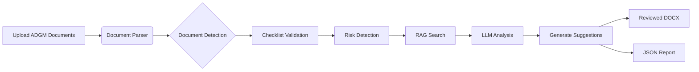
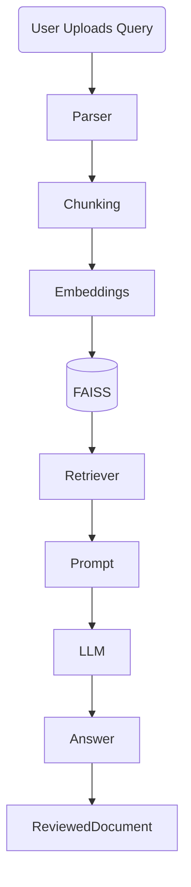
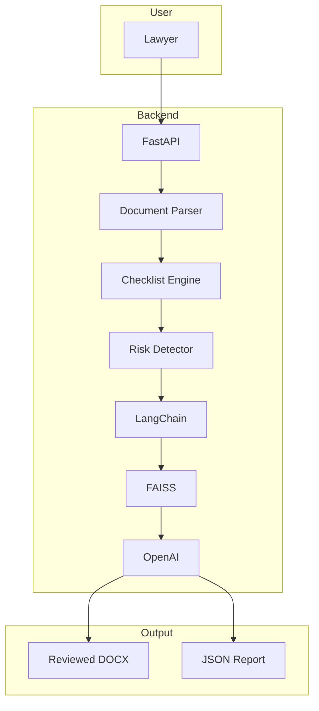
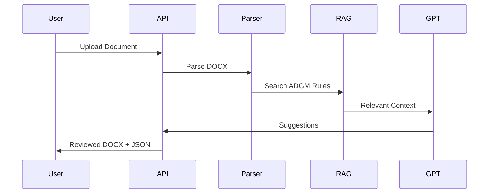

<div align="center">

# ⚖️ Corporate Agent
### AI-Powered ADGM Legal Document Review using RAG + LLM


<p align="center">


</p>

</div>

---

# 📖 Overview

Corporate Agent is an **AI-powered Legal Document Review System**
built specifically for **ADGM (Abu Dhabi Global Market)** legal documents.

Instead of manually checking hundreds of pages, lawyers simply upload documents.

The AI automatically

✅ Detects document type

✅ Finds missing documents

✅ Flags legal risks

✅ Reviews clauses

✅ Retrieves ADGM regulations using RAG

✅ Suggests improvements using LLM

✅ Generates reviewed DOCX + JSON report

---

# 🚀 System Workflow



---

# 🧠 RAG Architecture



---

# ⚙️ AI Review Pipeline

```text

        📄 Upload Document
                │
                ▼
     ┌────────────────────┐
     │ Document Detection │
     └────────────────────┘
                │
                ▼
     ┌────────────────────┐
     │ Clause Extraction  │
     └────────────────────┘
                │
                ▼
     ┌────────────────────┐
     │ Missing Documents  │
     └────────────────────┘
                │
                ▼
     ┌────────────────────┐
     │ Red Flag Detector  │
     └────────────────────┘
                │
                ▼
     ┌────────────────────┐
     │  RAG Retrieval     │
     └────────────────────┘
                │
                ▼
     ┌────────────────────┐
     │ GPT Recommendations│
     └────────────────────┘
                │
                ▼
      Reviewed DOCX + JSON

```

---

# 🔥 Features

## 📑 Automated Document Analysis

- Detects ADGM legal document types
- Reviews contracts automatically
- Finds missing clauses

---

## ⚠️ Risk Detection

Flags

- Missing Signatories
- Non-ADGM References
- Missing Approvals
- Ambiguous Language
- Compliance Issues

---

## 📚 RAG Knowledge Base

Uses Retrieval-Augmented Generation to search

- ADGM Regulations
- Legal References
- Corporate Policies
- Compliance Documents

before generating answers.

---

## 🤖 LLM Assistant

Provides

- Legal Explanation
- Clause Suggestions
- Compliance Advice
- Smart Summaries

---

## 📄 Output Generation

Produces

✔ Reviewed DOCX

✔ JSON Summary

✔ Compliance Report

✔ AI Suggestions

---

# 📊 Project Architecture



---

# 📈 Review Process Animation

```text

Uploading Document...

██████████░░░░░░░░ 35%

Parsing...

████████████████░░ 72%

Searching ADGM Database...

██████████████████ 90%

Generating AI Suggestions...

██████████████████████ 100%

✓ Review Completed

```

---

# 🛠 Tech Stack

| Technology | Purpose |
|------------|----------|
| Python | Backend |
| FastAPI | API |
| LangChain | RAG |
| OpenAI GPT | LLM |
| FAISS | Vector Search |
| DOCX | Document Processing |
| JSON | Report Generation |
| NLP | Text Processing |

---

# 📂 Folder Structure

```text
Corporate-Agent/

│

├── app/

│ ├── parser.py

│ ├── rag.py

│ ├── llm.py

│ ├── checklist.py

│ ├── reviewer.py

│

├── vector_db/

├── prompts/

├── uploads/

├── outputs/

├── docs/

└── main.py

```

---

# 💡 Example Workflow

```text

Upload:
↓

Shareholder Agreement.docx

↓

Document Detection

↓

Checklist Validation

↓

Risk Detection

↓

RAG Search

↓

GPT Review

↓

Reviewed Agreement.docx

↓

JSON Report

```

---

# 📊 AI Decision Flow



---

# 🌟 Highlights

- AI Legal Assistant
- Retrieval-Augmented Generation
- LLM Reasoning
- Document Intelligence
- Clause Analysis
- Compliance Automation
- Legal NLP
- JSON Report Generation
- DOCX Review Engine

---

<div align="center">

## ⭐ If you like this project, don't forget to Star it!


</div>
